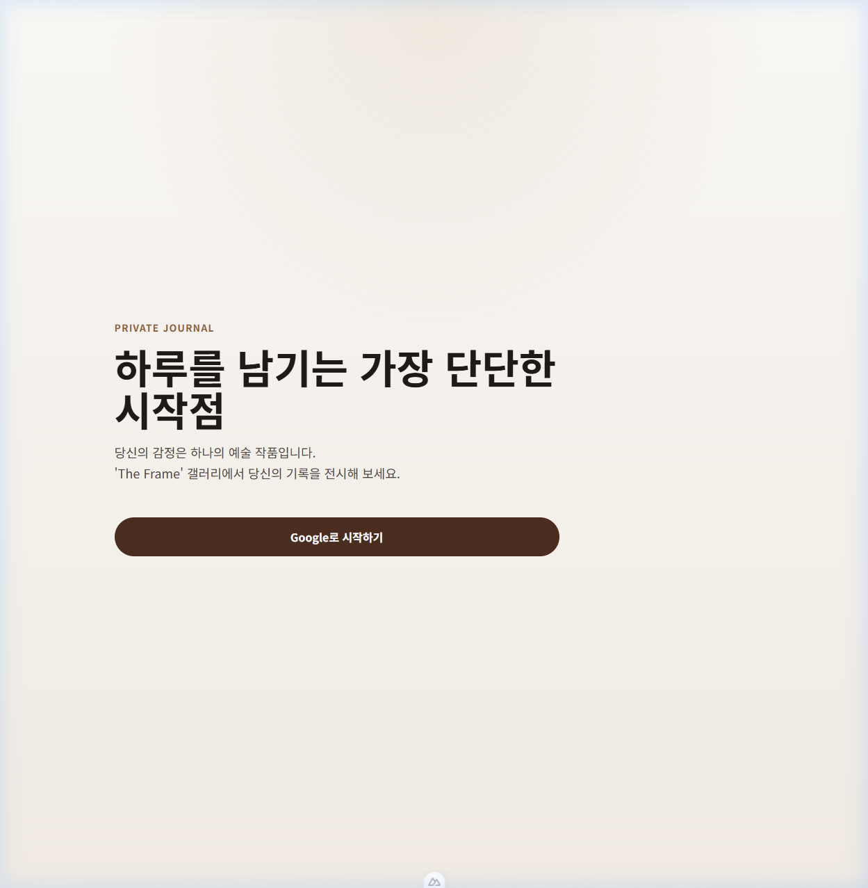

# HAU Diary 서비스 워크스루 (Visual Walkthrough)

> 최종 업데이트: 2026-05-14
> 목적: 현재 프로젝트의 시각적 구현 상태 및 기능 동작 확인

---

## 1. 현재 완성된 화면

### 🖼️ 로그인 페이지 (Landing)

- **디자인 컨셉**: 프리미엄 2D 갤러리 월 테마
- **주요 기능**: Google OAuth 인증 버튼
- **상태**: 구현 완료 (Supabase Auth 연동)

### 🎨 홈 화면 (2D 갤러리 월) — *신규 적용*
- **기능**: 사용자의 일기가 상대 좌표 기반(Relative Coordinate Model)의 2D 살롱 스타일로 배치됨.
- **인터랙션**: CSS Transform 기반의 부드러운 스크롤 및 프레임 Hover 줌(Zoom) 효과. 클릭 시 상세 일기로 다이브(Dive).
- **상태**: 3D(TresJS)에서 2D 렌더링으로 전환 완료. 모바일 최적화 및 커스텀 확장성 확보.

### 📂 일기 목록 (Diary List) — *진행 중*
- **기능**: 월별 네비게이션, 감정 배지가 포함된 카드 리스트
- **정렬**: 최신순 (created_at DESC)
- **보안**: RLS 적용으로 본인 데이터만 노출

### ✍️ 일기 작성 (Diary Write) — *진행 중*
- **기능**: 제목 입력, 감정 선택, 오늘의 질문 배너, 본문 입력(Counter 포함)
- **보안**: 미저장 이탈 방지 경고창(Dirty check)

---

## 2. 기술적 정합성 (Vue/Nuxt 구조)

사용자님께서 직접 확인하시기 어려운 코드 내부 상황을 요약해 드립니다.

| 영역 | 상태 | 설명 |
| --- | :---: | --- |
| **데이터 저장** | ✅ 정상 | Supabase `entries` 테이블에 안정적으로 저장됨 |
| **보안(RLS)** | ✅ 정상 | 남이 내 일기를 볼 수 없도록 데이터베이스 레벨에서 차단됨 |
| **아키텍처** | ✅ 최우수 | FSD 구조를 준수하며, 모든 비즈니스 로직은 Store에서 관리됨 |
| **타입 안정성** | ✅ 정상 | TypeScript 타입 에러가 모두 해결되어 빌드 시 결함 없음 |

---

## 3. 사용자 테스트 가이드

이 보고서를 보신 후 직접 확인해 보시려면 아래 순서로 진행해 보세요:

1. 브라우저에서 `http://localhost:3001` 접속
2. **Google로 시작하기** 클릭하여 로그인
3. 상단 **'기록'** 메뉴에서 본인이 쓴 글들이 잘 보이는지 확인
4. 글쓰기 버튼을 눌러 새 글을 작성해 보고, 목록에 즉시 나타나는지 확인

> **Tip**: 제가 찍어드린 스크린샷과 실제 화면이 일치하는지 비교해 보세요!
